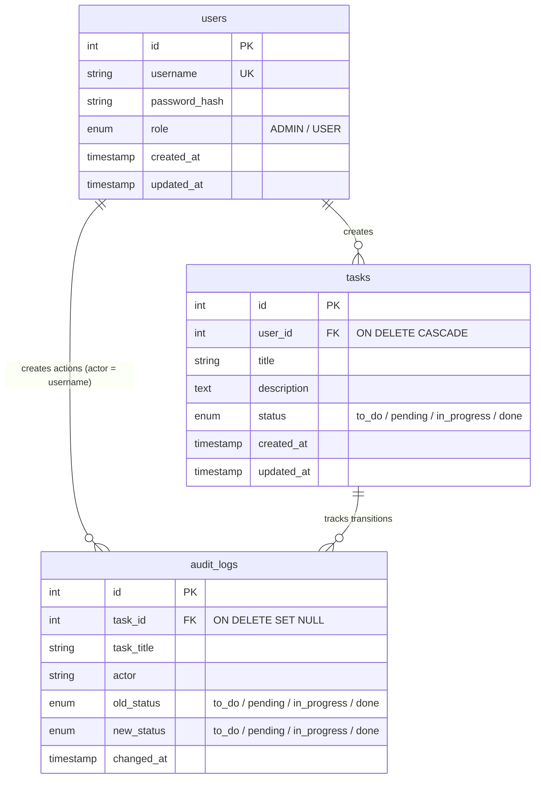

# Project Planning & Architecture - Mini Task Manager

This document acts as the index and development roadmap for the **Mini Task Manager** application.

---

## 1. Document Index

- **Product Requirements**: See [plans/PRD.md](./PRD.md).
- **UI/UX Design**: See [plans/DESIGN.md](./DESIGN.md).
- **System Architecture**: See [plans/SYSTEM_ARCHITECTURE.md](./SYSTEM_ARCHITECTURE.md).
- **Feature Validation**: See [plans/VALIDATION_RESULTS.md](./VALIDATION_RESULTS.md).
- **API Reference**: See [plans/API.md](./API.md).

---

## 2. Entity Relationship Diagram (ERD)

### Mermaid Specification



### Database Tables (MySQL DDL)

```sql
CREATE TABLE IF NOT EXISTS users (
    id INT AUTO_INCREMENT PRIMARY KEY,
    username VARCHAR(255) UNIQUE NOT NULL,
    password_hash VARCHAR(255) NOT NULL,
    role ENUM('ADMIN', 'USER') NOT NULL DEFAULT 'USER',
    created_at TIMESTAMP DEFAULT CURRENT_TIMESTAMP,
    updated_at TIMESTAMP DEFAULT CURRENT_TIMESTAMP ON UPDATE CURRENT_TIMESTAMP
) ENGINE=InnoDB;

CREATE TABLE IF NOT EXISTS tasks (
    id INT AUTO_INCREMENT PRIMARY KEY,
    user_id INT NOT NULL,
    title VARCHAR(255) NOT NULL,
    description TEXT,
    status ENUM('to_do', 'pending', 'in_progress', 'done') NOT NULL DEFAULT 'to_do',
    created_at TIMESTAMP DEFAULT CURRENT_TIMESTAMP,
    updated_at TIMESTAMP DEFAULT CURRENT_TIMESTAMP ON UPDATE CURRENT_TIMESTAMP,
    FOREIGN KEY (user_id) REFERENCES users(id) ON DELETE CASCADE
) ENGINE=InnoDB;

CREATE TABLE IF NOT EXISTS audit_logs (
    id INT AUTO_INCREMENT PRIMARY KEY,
    task_id INT NULL,
    task_title VARCHAR(255) NOT NULL,
    actor VARCHAR(255) NOT NULL,
    old_status ENUM('to_do', 'pending', 'in_progress', 'done') NULL,
    new_status ENUM('to_do', 'pending', 'in_progress', 'done') NOT NULL,
    changed_at TIMESTAMP DEFAULT CURRENT_TIMESTAMP,
    FOREIGN KEY (task_id) REFERENCES tasks(id) ON DELETE SET NULL
) ENGINE=InnoDB;
```

---

## 3. Development Roadmap

- [x] **Step 1: Setup Workspace scaffolding**
  - Clean up goals and habits modules from backend and frontend, preserving `auth` and `user` configurations.
- [x] **Step 2: Database Schema & Migration**
  - Update DDL in `be/src/db/schema.sql` (defining `users`, `tasks`, and `audit_logs`).
  - Rewrite `be/src/db/migrate.ts` to wait for DB connection and seed default tasks, standard user accounts, a default administrator `admin` (password: `admin123`, role: `ADMIN`), and initial audit logs.
- [x] **Step 3: Backend Task Module**
  - Define interfaces in `be/src/modules/task/task.types.ts`.
  - Write SQL repository query methods in `be/src/modules/task/task.repository.ts` implementing MySQL pool transactions, task ownership clauses (`WHERE tasks.user_id = ?` for `USER`), and log filters (`WHERE actor = ?` for `USER`).
  - Implement sequential transition checks and idempotency guards in `be/src/modules/task/task.service.ts`.
  - Create REST controller mapping in `be/src/modules/task/task.controller.ts` and routes in `be/src/routes/task.routes.ts`.
- [x] **Step 4: Frontend Auth Pages**
  - Adapt `fe/src/app/login/page.tsx` and `fe/src/app/register/page.tsx` forms to authenticate the user and save token + role payload in cookies/context.
- [x] **Step 5: Frontend Task Service & Dashboard**
  - Implement API endpoints call hooks in `fe/src/services/task/use-tasks.ts` using Axios with credentials enabled.
  - Build dashboard in `fe/src/app/page.tsx` rendering user username, logout button, role badge, and task columns.
- [x] **Step 6: Task Actions & Transition Buttons**
  - Display task cards grouped by status. Add sequential progression buttons mapping to PUT status requests.
- [x] **Step 7: Admin Global Logs Modal/Drawer**
  - Create `global-audit-logs.tsx` rendered conditionally only if the user has `ADMIN` role.
- [x] **Step 8: Verification & Compilation Checks**
  - Run containers via `docker compose up`. Check TypeScript compilations and run audit-trail test cases.
